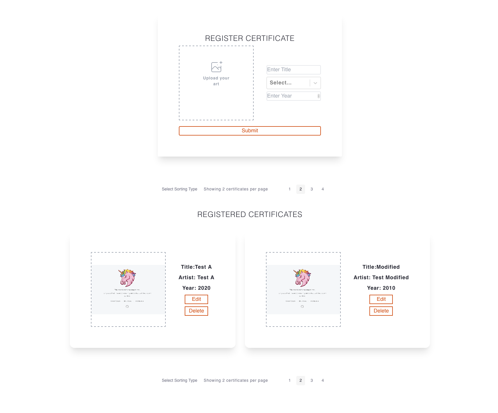

# Certificate Collection Challenge

## Back end

Repository architecture
- Controller (Endpoints)
    - Artist
    - Certificate
- Deserializer
    - Converts string based json request, to entity objects.
- Entity ( Models):
    - Artist
    - Certificate
- Repository
    - Implementation of logic for how to work with entities.
    - Functionality provided by the Spring @Repository bean
- Service
    - More specific business logic of repository interactions.
    - Sets up CRUD operations making use of the repository bean
- Utils
   - Pageable Factory (Helper method for creating new page response)
   
### Tests
- Certificate Deserialiser
    - As this logic was somewhat complex to deal with image base64 strings, to bytearray.
- Artist Service
    - Tests back end api has correct business logic set up for CRUD operations
- Certificate Service
    - Tests back end api has correct business logic set up for CRUD operations
- Endpoint testing for most part is done from front end, end to end tests.

## Front end

Clean architecture for endpoints. (Bob Martin)
- Abstracts away the API implementation.
- Keeps state management in one place - with:
    - Context hooks,
    - state management,
    - Reducers
- Core Endpoint Management:
    - Entities (Models)
    - Repositories (Interfaces for endpoint interaction)
    - Infrastructure (Implementation of repository endpoints)
    - usecases (Services, Business logic without fully concrete, additional abstractions)
- Having a [SOLID](https://en.wikipedia.org/wiki/SOLID) architecture allows for scalability.
    - Additional sorting rules? no problem.
    - Extend front end UI without worrying about breaking logic.
    
- Tailwind as a design utility framework, speeds up development with an opinionated framework that is easily extensible.
- Vite as a modern bundling framework
    - 💡 Instant Server Start
    - ⚡️ Lightning Fast HMR (Hot Module Reloading)
    - 🛠️ Rich Features
    - 📦 Optimized Build
    - 🔩 Universal Plugin Interface
    - 🔑 Fully Typed APIs

### Features:
- Pagination
- Sort by artist's surname
- Certificate Form
- Certificate Collection to view all certificates
- Image file upload
- Image rendering

### Tests:
Basic End to end testing with Cypress.
Basic logic testing with Jest.
- Logic separated from front end as per "clean architecture"
    - Enables easier testing of front end, as testing from components is generally quite unstable.
    

# Time Breakdown
Benefits of using a well-structured, pattern based implementation.

- 1hr Kotlin back end.
- 1.5 hr UI Implementation
- 1 hr State Management
- 2hr Tests, front end, back end

- ~ 5.5 hrs, also found a very hard time to find much time, 
    as have just moved house, currently finishing off a dissertation,
    no internet until next week, 
    and very limited phone hotspot connection.
